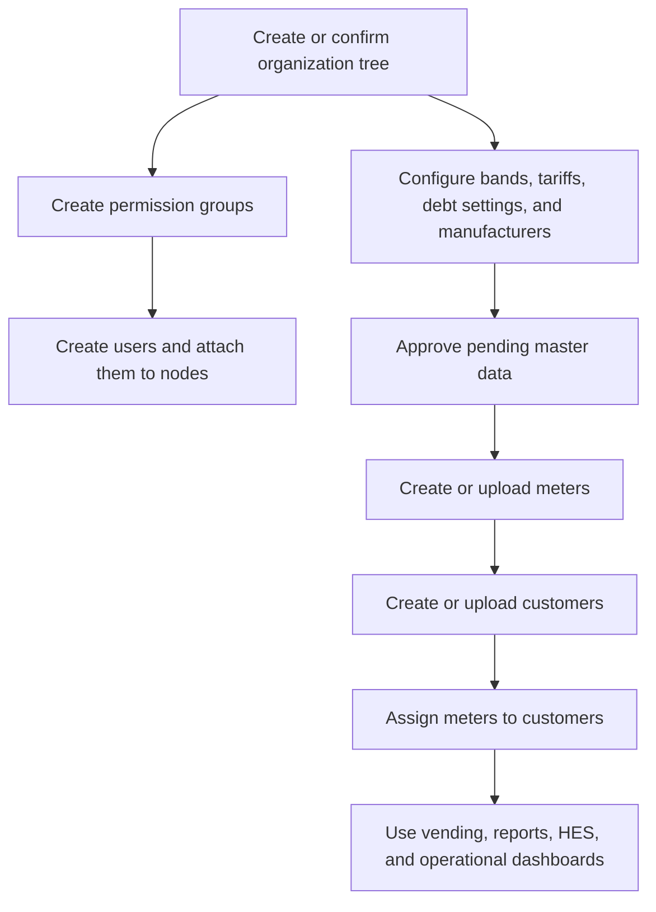
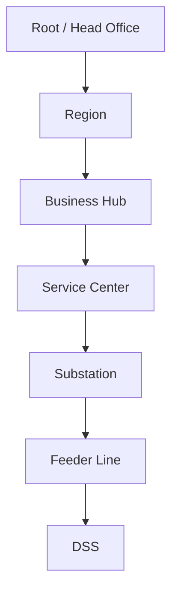
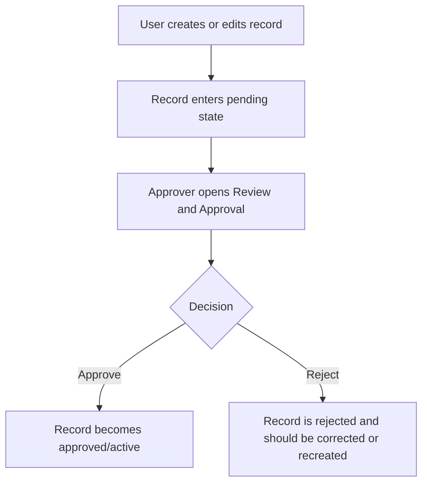
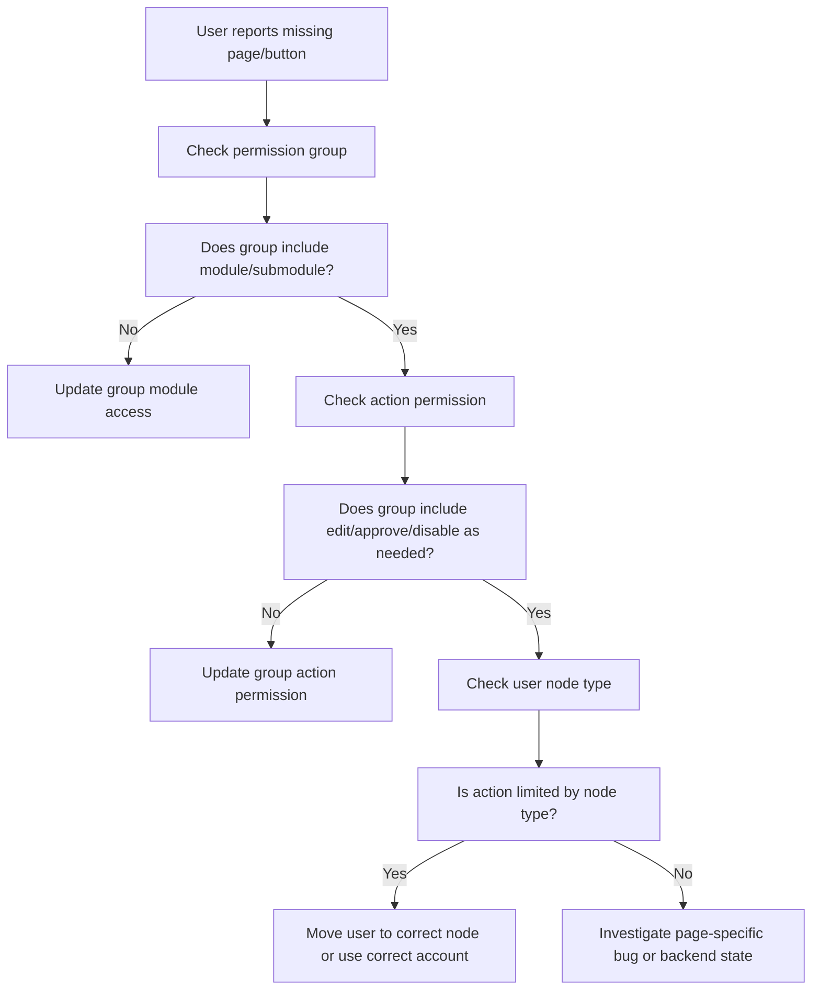
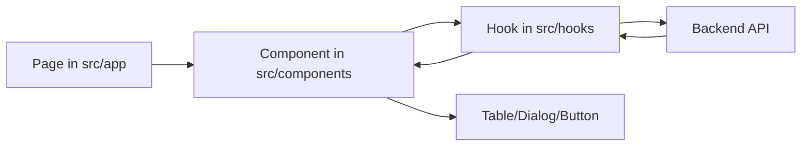

# GridFlex Portal Onboarding Guide

This guide is for a new teammate who needs to understand how the GridFlex portal works before touching much code. It explains the business decisions behind the main flows: how the portal is organized, how users get access, how regions and other units depend on each other, how customer and meter setup works, and why approvals appear in the process.

The examples here are based on the current frontend implementation in `gridflex`. Backend rules may add extra validation, but this is the portal behavior a user sees.

## 1. The Short Version

GridFlex is an operations portal for managing an electricity distribution business. The portal is built around five ideas:

1. **Organization hierarchy**: the business is divided into nodes such as Root, Region, Business Hub, Service Center, Substation, Feeder Line, and DSS.
2. **Permission groups**: a group decides which modules a user can see and what actions they can perform.
3. **Users**: every user belongs to one organization node and one permission group.
4. **Operational master data**: bands, tariffs, meters, customers, debt settings, and meter manufacturers must be configured before daily work can happen.
5. **Review and Approval**: important Data Management changes are staged for approval before becoming fully active.

In practice, onboarding a new operating area usually follows this order:

If a button or page is missing, first check the user's permission group and node type.

## 2. Repository Map

The workspace contains multiple projects:

| Folder                     | Purpose                                                                                           |
| -------------------------- | ------------------------------------------------------------------------------------------------- |
| `gridflex`                 | Current customer-facing/admin frontend portal. This is the main frontend discussed in this guide. |
| `gridflex-backend-service` | Main backend service. Spring Boot/Maven service.                                                  |
| `hes-backend-springboot`   | HES-related backend service.                                                                      |
| `gridflex-admin-portal`    | Another frontend/admin project.                                                                   |
| `gridflex-landing-page`    | Marketing or landing page project.                                                                |

Inside `gridflex`:

| Path                             | Purpose                                                                |
| -------------------------------- | ---------------------------------------------------------------------- |
| `src/app/(protected)`            | Authenticated portal routes.                                           |
| `src/components`                 | Page components, tables, dialogs, and module UI.                       |
| `src/hooks`                      | React Query hooks and API-facing frontend logic.                       |
| `src/context/auth-context.tsx`   | Login, logout, user session, and route entry behavior.                 |
| `src/components/sidebar-nav.tsx` | Main navigation and module visibility rules.                           |
| `src/utils/permissions.ts`       | Basic permission helpers and post-login landing route.                 |
| `src/types`                      | Frontend data shapes for users, meters, vending, approvals, and so on. |

Common frontend commands:

| Command             | Use                                     |
| ------------------- | --------------------------------------- |
| `npm run dev`       | Start local Next.js development server. |
| `npm run typecheck` | Check TypeScript.                       |
| `npm run lint`      | Run linting.                            |
| `npm run build`     | Build the frontend.                     |

## 3. Core Mental Model

### 3.1 Organization Nodes

The organization tree is the business structure. It controls where data belongs and what scope a user operates within.

The frontend recognizes these hierarchy levels:

The organization module allows adding:

| Node Type          | Typical Meaning                                 |
| ------------------ | ----------------------------------------------- |
| Root / Head Office | The top of the business.                        |
| Region             | A large operating area.                         |
| Business Hub       | A business unit under a region.                 |
| Service Center     | A lower operating office under a business hub.  |
| Substation         | Technical network asset under a service center. |
| Feeder Line        | Technical feeder under a substation.            |
| DSS                | Distribution substation under a feeder line.    |

Business decisions:

- Users are attached to a node, so the node determines their operational scope.
- Some actions are intentionally limited to specific node levels.
- In Customer Management, the current rule is that **Business Hub** and **Service Center** users can add or upload customers, because those levels own the direct customer relationship.
- Meter Inventory is hidden from Business Hub and Service Center users. That is separate from customer creation: these users can own customer onboarding without managing central meter stock.

### 3.2 Permission Groups

Permission groups decide two things:

1. Which modules and submodules a user can see.
2. Which actions the user can perform.

The main action permissions are:

| Permission | Meaning                                     |
| ---------- | ------------------------------------------- |
| `view`     | User can see the module/page.               |
| `edit`     | User can create or edit records.            |
| `approve`  | User can approve or reject pending records. |
| `disable`  | User can disable supported records.         |

The portal navigation checks the user's group modules and submodules. Most sidebar pages are hidden unless the assigned group has access to that module/submodule. Two current exceptions are Audit Log and Incident Report, which are marked as always visible in the sidebar component.

### 3.3 Users

A user depends on:

- A permission group.
- An organization hierarchy level.
- A specific unit/node at that hierarchy level.
- Basic profile details and a default password.

When creating a user, the portal sends:

- `groupId`: selected permission group.
- `nodeId`: selected organization unit.
- user profile fields: first name, last name, email, password, and related details.

This is why organization setup and group permission setup should happen before user onboarding.

Current Add User behavior supports assigning users to Head Office, Region, Business Hub, and Service Center. The organization tree can contain Substation, Feeder Line, and DSS nodes, but those lower technical nodes are not currently offered as user hierarchy choices in the Add User form.

## 4. Module Overview

### 4.1 Data Management

Data Management is the foundation module. It contains:

| Submodule           | Purpose                                           | Depends On                               | Output                                               |
| ------------------- | ------------------------------------------------- | ---------------------------------------- | ---------------------------------------------------- |
| Dashboard           | Summary view of data management activity.         | Existing data.                           | Operational overview.                                |
| Organization        | Build the hierarchy tree.                         | Root/business setup.                     | Regions, hubs, service centers, and technical nodes. |
| Meter Manufacturers | Add manufacturers.                                | None beyond permission.                  | Manufacturer list used by meter setup.               |
| Meter Inventory     | Manage physical meter stock.                      | Manufacturers and meter details.         | Available meters.                                    |
| Meters              | Create and edit meter records.                    | Manufacturers, technical meter data.     | Meters awaiting or passing approval.                 |
| Assigned Meter      | Attach meters to customers.                       | Customers and meters.                    | Active customer-meter relationship.                  |
| Customer Management | Add, edit, upload, block, unblock customers.      | Organization/user scope.                 | Customer records.                                    |
| Band Management     | Configure supply bands.                           | None beyond permission.                  | Bands, usually approval-managed.                     |
| Tariff Rate         | Configure tariff rates.                           | Bands.                                   | Tariffs, usually approval-managed.                   |
| Debt Setting        | Configure liability causes and percentage ranges. | Bands for percentage ranges.             | Debt configuration.                                  |
| Debit Adjustment    | Apply debit-related adjustments.                  | Customers/meters and debt configuration. | Adjustment records.                                  |
| Credit Adjustment   | Apply credit-related adjustments.                 | Customers/meters and debt configuration. | Adjustment records.                                  |
| Review and Approval | Approve or reject pending changes.                | Pending records from Data Management.    | Approved or rejected records.                        |

### 4.2 User Management

User Management contains:

| Submodule        | Purpose                                                                   |
| ---------------- | ------------------------------------------------------------------------- |
| Group Permission | Create permission groups and decide module/action access.                 |
| Users            | Create users and attach them to permission groups and organization nodes. |

Important decision: create permission groups before adding users. A user without the right group may log in but see the wrong pages or miss required buttons.

### 4.3 Vending

Vending generates tokens for customers/meters. The visible token flows include:

| Token Flow           | What It Does                                               |
| -------------------- | ---------------------------------------------------------- |
| Credit Token         | Calculates payment result first, then generates the token. |
| KCT                  | Generates key change token.                                |
| Clear Tamper         | Generates clear tamper token.                              |
| Clear Credit         | Generates clear credit token.                              |
| KCT and Clear Tamper | Generates a combined KCT/clear tamper token.               |
| Compensation         | Generates compensation token based on unit value.          |

Vending depends on customer and meter setup. If a meter is not created, approved, and assigned correctly, vending will fail or return incomplete results.

### 4.4 HES

HES is for meter communication and technical operations. The frontend includes:

| Submodule                  | Purpose                            |
| -------------------------- | ---------------------------------- |
| Dashboard                  | HES overview.                      |
| Communication Report       | Meter communication reporting.     |
| Realtime Data              | Live or near-live meter data.      |
| Profile and Events         | Meter profile/event data.          |
| Meter Remote Configuration | Remote configuration and controls. |

### 4.5 Audit, Reports, And Incidents

These modules are supporting modules:

| Module          | Purpose                                  |
| --------------- | ---------------------------------------- |
| Audit Log       | Track user/system activity.              |
| Report Summary  | Reporting and export-oriented summaries. |
| Incident Report | Operational issue reporting.             |

Billing routes exist in the frontend, but the Billing sidebar section is currently commented out. Change Log and About Us are defined in the sidebar source but are filtered out of the rendered sidebar.

## 5. Recommended Onboarding Sequence

Use this when setting up a new operating area or bringing a team onto the portal.

### Step 1: Confirm Admin Access

Start with a Root or Super Admin user. The user should have:

- Data Management access.
- User Management access.
- Edit permission.
- Approve permission if they will approve pending setup data.

The login flow stores the authenticated user and redirects them to the first module their permission group allows.

### Step 2: Build the Organization

Go to:

`Data Management > Organization`

Create nodes from the top down:

1. Region.
2. Business Hub under Region.
3. Service Center under Business Hub.
4. Substation under Service Center.
5. Feeder Line under Substation.
6. DSS under Feeder Line.

Why order matters: child nodes require a parent. For example, a Service Center needs a Business Hub parent, and a Feeder Line needs a Substation parent.

### Step 3: Create Permission Groups

Go to:

`User Management > Group Permission`

Create groups based on job responsibilities, not individual people. Example groups:

| Group                 | Suggested Access                                              |
| --------------------- | ------------------------------------------------------------- |
| Super Admin           | All modules, all action permissions.                          |
| Regional Data Manager | Data Management, Customer Management, Meter Management, edit. |
| Regional Approver     | Review and Approval, approve.                                 |
| Vending Operator      | Vending access, edit.                                         |
| HES Operator          | HES access, view/edit depending on responsibility.            |
| Auditor               | Audit Log and Report Summary, view only.                      |

The portal supports module-level and Data Management submodule-level access. For example, a user can have Data Management access but only see Customer Management and Review and Approval if that is how the group is configured.

### Step 4: Create Users

Go to:

`User Management > Users`

Each user must be attached to:

- A group permission.
- A hierarchy type.
- A unit name under that hierarchy.

Example: A regional user should choose `Region` as the hierarchy and then choose the specific region as the unit.

Root/Head Office users are attached to the root node automatically after selecting the root hierarchy.

Current Add User hierarchy options are Head Office, Region, Business Hub, and Service Center.

### Step 5: Configure Master Data

Set up the operational data needed before customers and meters can work cleanly.

Recommended order:

1. `Data Management > Band Management`
2. `Data Management > Tariff Rate`
3. `Data Management > Debt Management > Debt Setting`
4. `Data Management > Meter Management > Meter Manufacturers`
5. `Data Management > Meter Management > Meters` or `Meter Inventory`

Why order matters:

- Tariffs depend on bands.
- Percentage ranges in debt settings can depend on bands.
- Meters depend on manufacturers and meter technical details.
- Vending depends on valid customers and assigned meters.

### Step 6: Approve Pending Master Data

Go to:

`Data Management > Review and Approval`

The approval tabs include:

- Percentage Range.
- Liability Cause.
- Band.
- Tariff.
- Meter.

Approvers can inspect details, approve, reject, or bulk approve supported records.

Important decision: the portal separates create/edit from approve/reject so one user can prepare data while another user validates it. This reduces accidental activation of wrong tariffs, bands, debt settings, and meter records.

### Step 7: Add Customers

Go to:

`Data Management > Customer Management`

Current frontend rule:

- Business Hub and Service Center users can see Add Customer and Upload Customer.
- Root/Head Office and Region users do not see those actions.

Customers can be added individually or uploaded in bulk. Customer records include identity/contact information, location, address, and VAT preference.

Note: this Add/Upload visibility is currently based on node type. Row-level customer actions such as edit, assign meter, block, and related table actions are controlled by edit permission.

### Step 8: Assign Meters

Go to:

`Data Management > Meter Management > Assigned Meter`

Meter assignment connects a customer to a meter. This flow depends on:

- Customer exists.
- Meter exists.
- Required meter image/payment mode information is provided where applicable.
- The backend accepts the assignment state.

This relationship is what makes later vending and operational lookup meaningful.

### Step 9: Vend Tokens

Go to:

`Vending > Vending`

Before vending, confirm:

- The user has Vending access and edit permission.
- Customer exists.
- Meter exists and is assigned.
- The meter/account number is correct.
- Required token-specific fields are filled.

Credit token flow has two stages:

1. Calculate the vend details.
2. Generate the final token.

Other token flows generally generate the token after the required fields are submitted.

### Step 10: Monitor, Report, and Audit

Use dashboards, reports, HES views, and audit logs to confirm operations:

- Data Management Dashboard for setup activity.
- Vending Dashboard for vending activity.
- HES Dashboard and reports for meter communication.
- Audit Log for user/system traceability.
- Report Summary for export and review.

## 6. Approval Flow

Approval is a central business control in Data Management.

Records covered by the current approval UI:

| Record Type      | Approval Tab     |
| ---------------- | ---------------- |
| Band             | Band             |
| Tariff           | Tariff           |
| Meter            | Meter            |
| Liability Cause  | Liability Cause  |
| Percentage Range | Percentage Range |

Operational guidance:

- Do not assume a saved record is active until its approval status is confirmed.
- If a newly created band or tariff is missing elsewhere, check Review and Approval.
- Rejections should include enough context for the creator to know what to fix.
- Bulk approval is useful after careful filtering and review, not as a replacement for validation.

## 7. Access Control and Missing Buttons

When a user says "I cannot see this page" or "I cannot see this button", troubleshoot in this order:

Common examples:

| Symptom                     | Likely Cause                                                                      |
| --------------------------- | --------------------------------------------------------------------------------- |
| Sidebar page is missing     | Group does not have module/submodule access.                                      |
| Add/Edit button is missing  | Group lacks edit permission, or page has node-type restrictions.                  |
| Approve/Reject missing      | Group lacks approve permission or Review and Approval access.                     |
| Meter Inventory missing     | User node type is Business Hub or Service Center.                                 |
| Add/Upload Customer missing | User is not Business Hub or Service Center.                                       |
| Vending action blocked      | User lacks Vending access/edit permission, or meter/customer setup is incomplete. |

Audit Log and Incident Report are sidebar exceptions because they are configured as always visible in the current frontend.

## 8. Practical Runbooks

### 8.1 Add a New Region and Operating Units

1. Log in with a Root/Super Admin account.
2. Open `Data Management > Organization`.
3. Add a Region under Root.
4. Add Business Hub under that Region.
5. Add Service Center under that Business Hub.
6. Add technical nodes if needed: Substation, Feeder Line, DSS.
7. Confirm each node appears in the organization tree.

### 8.2 Add a New User

1. Confirm the organization node already exists.
2. Confirm the permission group already exists.
3. Open `User Management > Users`.
4. Click Add User.
5. Enter profile details.
6. Select Group Permission.
7. Select Organizational Hierarchy.
8. Select Unit Name.
9. Set default password.
10. Save.
11. Ask the user to log in and confirm their landing page and sidebar access.

### 8.3 Create a Data Manager and an Approver

This is a good separation-of-duty pattern.

Data Manager group:

- Data Management access.
- Required submodules such as Organization, Meter Management, Customer Management, Band Management, Tariff, Debt Management.
- Edit permission.

Approver group:

- Data Management access.
- Review and Approval submodule.
- Approve permission.
- View permission.

Then create two users and attach each user to the correct group and node.

### 8.4 Add Band and Tariff

1. Open `Data Management > Band Management`.
2. Create the band.
3. Open `Data Management > Review and Approval`.
4. Approve the band.
5. Open `Data Management > Tariff Rate`.
6. Create the tariff and link it to the approved band.
7. Return to Review and Approval.
8. Approve the tariff.

### 8.5 Add Customer and Assign Meter

1. Confirm the user is Business Hub or Service Center if they need to add or upload customers.
2. Open `Data Management > Customer Management`.
3. Add customer or upload customer file.
4. Confirm the meter exists and is available.
5. Open `Data Management > Meter Management > Assigned Meter`.
6. Select customer and meter.
7. Complete payment mode and image steps if requested.
8. Submit assignment.
9. Confirm the assigned meter appears in the relevant table.

### 8.6 Vend a Credit Token

1. Open `Vending > Vending`.
2. Choose Credit Token.
3. Choose whether to vend by Meter Number or Account Number.
4. Enter meter/account number.
5. Enter amount tendered.
6. Proceed to calculate.
7. Review the calculated result.
8. Generate token.
9. Print if required.

### 8.7 Approve or Reject Pending Changes

1. Open `Data Management > Review and Approval`.
2. Choose the correct tab.
3. Search/filter to find the pending record.
4. View details.
5. Approve if correct.
6. Reject if incorrect.
7. Confirm the record status changes.

## 9. Data Dependency Cheat Sheet

| Thing You Want To Do     | Must Exist First                                                   |
| ------------------------ | ------------------------------------------------------------------ |
| Add a user               | Organization node and permission group.                            |
| Show a module in sidebar | User group with module/submodule access.                           |
| Show Add/Edit actions    | User group with edit permission and any required node type.        |
| Add/upload customers     | Business Hub or Service Center user node type.                     |
| Approve records          | User group with approve permission and Review and Approval access. |
| Create tariff            | Band.                                                              |
| Create percentage range  | Usually band and debt setting context.                             |
| Create meter             | Manufacturer and meter technical details.                          |
| Assign meter             | Customer and meter.                                                |
| Vend token               | Assigned customer/meter/account setup.                             |
| See HES data             | HES access and backend meter communication data.                   |

## 10. Developer Appendix

This section is for a teammate who will occasionally inspect code.

### Important Frontend Files

| Area                   | File                                |
| ---------------------- | ----------------------------------- |
| Auth/session           | `src/context/auth-context.tsx`      |
| Protected route shell  | `src/app/(protected)/layout.tsx`    |
| Sidebar/navigation     | `src/components/sidebar-nav.tsx`    |
| Permission helper      | `src/utils/permissions.ts`          |
| User type              | `src/types/user-info.ts`            |
| Organization UI        | `src/components/organization`       |
| User Management UI     | `src/components/usermanagement`     |
| Customer Management UI | `src/components/customermanagement` |
| Meter Management UI    | `src/components/meter-management`   |
| Review and Approval UI | `src/components/reviewandapproval`  |
| Vending UI             | `src/components/vending`            |

### How Frontend Data Usually Flows

Most server actions are wrapped in React Query hooks. That is why create/edit screens should use mutation pending states for loading UI.

### Approval UI

Review and Approval is split into table components:

- `bandtable.tsx`
- `tarifftable.tsx`
- `metertable.tsx`
- `liabilitycausetable.tsx`
- `percentagerangetable.tsx`

The shared confirmation dialog is:

- `confirmapprovaldialog.tsx`

### Current Business Rules Worth Remembering

- Business Hub and Service Center can add/upload customers.
- Business Hub and Service Center do not see Meter Inventory.
- Permission group access controls most sidebar visibility.
- Action permissions control create/edit/approve/disable behavior.
- Data Management records may need approval before they become operationally active.
- Vending depends on the customer-meter setup being correct.
